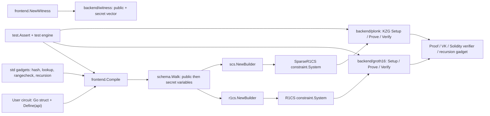

# Consensys/gnark

## Repository Identity

| Field | Value |
| --- | --- |
| Repository | `https://github.com/Consensys/gnark` |
| Analyzed ref | `master` |
| Analyzed commit | `cb367d86b8ad0cc1ee1a29b89658f2f92a461721` |
| Commit date | `2026-06-23T10:57:41+02:00` |
| Commit subject | `refactor: enforce least-privilege in GitHub Actions workflows (#1785)` |
| Latest release observed | `v0.15.0`, changelog date `2026-03-11` |
| Language/runtime | Go module targeting `go 1.25.7` (`go.mod:3`) |
| Main dependency | `github.com/consensys/gnark-crypto v0.20.1`; ICICLE bridge via `github.com/ingonyama-zk/icicle-gnark/v3 v3.2.2` |
| Project claim | High-performance zk-SNARK framework in Go; README states it powers Linea zk-rollup (`README.md:12`) |
| License | Apache-2.0 |

## Deep Reading Coverage

本次是仓库深读，不是 README 摘要。临时 clone 放在 `/tmp/nahida-repos/consensys-gnark`，没有写入 vault；用 CodeGraph 建索引后覆盖了核心包和调用链。

| Area | Files / symbols read | Why it matters |
| --- | --- | --- |
| User API and compilation | `frontend.Circuit` (`frontend/circuit.go:24`), `frontend.API` (`frontend/api.go:13`), `frontend.Compile` (`frontend/compile.go:38`), `CompileGeneric` (`frontend/compile.go:69`), `parseCircuit` (`frontend/compile.go:100`) | 定义用户电路如何从 Go struct + `Define(api)` 变成 constraint system。 |
| Witness | `frontend.NewWitness` (`frontend/witness.go:26`), witness binary protocol (`backend/witness/witness.go:15-19`), `Public`/`WriteTo`/`ReadFrom` (`backend/witness/witness.go:151`, `162`, `199`) | 证明输入如何按 public/secret 顺序编码、序列化和交给 backend。 |
| R1CS builder | `frontend/cs/r1cs.NewBuilder` (`frontend/cs/r1cs/builder.go:40`), blueprints (`frontend/cs/r1cs/builder.go:129`), `newR1C` (`frontend/cs/r1cs/builder.go:185`), `Compile` (`frontend/cs/r1cs/builder.go:276`) | Groth16 路线的约束生成、线性表达式压缩和 unconstrained-wire 检查。 |
| SCS builder | `frontend/cs/scs.NewBuilder` (`frontend/cs/scs/builder.go:39`), sparse blueprint (`frontend/cs/scs/builder.go:129`), add/mul gates (`frontend/cs/scs/builder.go:155`, `159`), `Compile` (`frontend/cs/scs/builder.go:290`) | PLONKish sparse-R1CS 路线，门形为 `qL*a + qR*b + qM*a*b + qO*c + qC == 0`。 |
| Constraint core | `ConstraintSystemGeneric` (`constraint/system.go:25`), `SystemType`/`PackedInstruction`/`System` (`constraint/core.go:20`, `30`, `77`), `Blueprint` (`constraint/blueprint.go:9`), `CheckUnconstrainedWires` (`constraint/core.go:428`) | 说明 gnark 为什么能把不同曲线、不同 arithmetization 和 solver 打包到同一抽象层。 |
| Groth16 backend | Dispatch API (`backend/groth16/groth16.go:54`, `85`, `114`, `153`, `180`), BN254 setup/prove/verify (`backend/groth16/bn254/setup.go:75`, `346`; `prove.go:52`; `verify.go:38`) | R1CS -> pk/vk/proof/verifier 的实际路径。 |
| PLONK backend | Dispatch API (`backend/plonk/plonk.go:59`, `75`, `94`, `117`, `138`), BN254 setup/prove/verify (`backend/plonk/bn254/setup.go:95`, `171`; `prove.go:98`, `205`; `verify.go:34`) | SparseR1CS -> KZG trace/quotient/opening 的实际路径。 |
| Accelerated proving | `backend/accelerated/icicle/doc.go:1-79`, deprecated `WithIcicleAcceleration` (`backend/backend.go:133`) | GPU acceleration 不是全局开关，而是显式 ICICLE backend + build tag。 |
| Standard library | lookup (`std/lookup/logderivlookup/logderivlookup.go:1-17`, `64`, `67`, `86`), rangecheck (`std/rangecheck/rangecheck.go:5`, `18`), hash registry (`std/hash/hash.go:18`, `std/hash/registry.go:65`, `99`), recursion verifiers (`std/recursion/groth16/verifier.go:493`, `521`; `std/recursion/plonk/verifier.go:645`, `917`) | gadgets、lookup/rangecheck、hash、recursion 是生产电路常用模块。 |
| Testing | `test.Assert.CheckCircuit` (`test/assert_checkcircuit.go:35`), build-tag profiles (`test/assert_checkcircuit.go:24-25`), deterministic compile check (`test/assert.go:312`, `335`), test engine (`test/engine.go:99`) | 说明项目如何验证 circuit、constraint solving、serialization、prover 和 solidity export。 |
| Examples | Cubic (`examples/cubic/cubic.go:12`, `21`), PLONK example (`examples/plonk/main.go:65`, `76`, `103`) | 展示最小 Groth16/R1CS 和 PLONK/SCS 用法。 |

Verification performed:

- `go list ./...` succeeded in the cloned repository.
- `go test -short ./frontend ./backend/witness ./backend/groth16 ./backend/plonk ./examples/cubic ./examples/plonk ./std/rangecheck ./std/lookup/logderivlookup` passed.

## Problem And Value

`gnark` 的核心价值是把 Go 语言里的电路 DSL、constraint compiler、witness encoding、Groth16/PLONK backend、Solidity verifier、standard gadgets 和测试框架放在一个工程化栈里。它不是一篇新的 zk-SNARK paper，也不是一个单一 protocol implementation；它更像 proof-system engineering layer，用来把应用电路稳定地带到可编译、可证明、可验证、可测试和可导出 verifier 的状态。

README 公开声称支持 Groth16 和 PLONK (`README.md:53-54`)，支持 BN254、BLS12-381、BLS12-377、BW6-761 等曲线，并提示 Solidity verifier export 是曲线相关的、BN254 是主要目标 (`README.md:65`)。README 也明确给出安全边界：项目虽然有多次审计，但按 as-is 提供，不保证 constant-time 或 side-channel resistance (`README.md:122-126`)。

## Architecture

## Main Modules

| Module | Implementation details | Reusable insight |
| --- | --- | --- |
| `frontend` | User circuit implements `Define(api API) error`; `CompileGeneric` parses options, instantiates the chosen builder, walks the circuit schema, allocates public variables before secret variables, calls `Define`, runs deferred callbacks, then asks the builder to compile (`frontend/compile.go:69-100`). `parseCircuit` requires pointer receiver and recovers user panics into errors (`frontend/compile.go:100`). | gnark treats circuit definition as an executable Go program whose side effect is constraint emission. Public/secret order is schema-driven and shared by compiler and witness builder. |
| `frontend.API` | Provides arithmetic, bit, comparison, assertion, selector, lookup, hints, logging and `Compiler()` access (`frontend/api.go:13`). Assertions like `AssertIsBoolean` emit constraints in the builder; `MarkBoolean` only marks known boolean variables in R1CS (`frontend/cs/r1cs/api_assertions.go:50`, `frontend/cs/r1cs/builder.go:227`). | Circuit authors get a compact API, but security/correctness depends on which calls actually constrain values. |
| `frontend.NewWitness` + `backend/witness` | Witness encoding is `[uint32(nbPublic) | uint32(nbSecret) | fr.Vector(variables)]`, public first then secret (`backend/witness/witness.go:15-19`). `NewWitness` mirrors schema walking and can create full or public-only witness (`frontend/witness.go:26`). | The public witness passed to verifier excludes secret variables and follows the circuit's schema order. Serialization stability is a compatibility surface. |
| `constraint` | `ConstraintSystemGeneric` exposes solving, serialization, counts, hints, debug logs, commitments and unconstrained-wire checks (`constraint/system.go:25`). `System` stores version, field, system type, packed instructions, blueprints, calldata, public/secret names, logs, levels and commitment info (`constraint/core.go:77`). | Constraint systems are not just lists of equations; gnark packs instructions through blueprints and records solver/debug metadata. |
| `frontend/cs/r1cs` | `NewBuilder` chooses curve-specific R1CS types and registers `BlueprintGenericR1C` / batch inverse (`frontend/cs/r1cs/builder.go:40`, `129`). `newR1C` normalizes `L * R == O` and may swap sides to improve proving/setup behavior (`frontend/cs/r1cs/builder.go:185`). `Compile` checks unconstrained wires unless ignored (`frontend/cs/r1cs/builder.go:276`). | R1CS is the Groth16-facing arithmetization; it optimizes expression form and uses blueprints rather than storing naive constraints only. |
| `frontend/cs/scs` | `NewBuilder` creates sparse R1CS for PLONK (`frontend/cs/scs/builder.go:39`). Sparse constraints use q-coefficients and a selector-like shape; builder keeps add/mul dedup maps and supports PLONK commitments (`frontend/cs/scs/api.go:659`, `705`, `757`). | PLONK route is a separate arithmetization with trace/permutation/KZG commitments, not simply Groth16 over a different proof backend. |
| `backend/groth16` | Top-level API dispatches by concrete proving/verifying key and curve (`backend/groth16/groth16.go:114`, `153`, `180`). BN254 setup samples toxic waste, builds ABC polynomials over domain and creates pk/vk (`backend/groth16/bn254/setup.go:75`, `346`). Prove solves R1CS, handles BSB22 commitments, computes H and MSMs (`backend/groth16/bn254/prove.go:52`). Verify checks subgroup/public witness, BSB22 commitments and pairing equation (`backend/groth16/bn254/verify.go:38`). | Groth16 path is per-circuit setup with toxic-waste caveat. Commitment support is integrated into proving and verification, not a post-processing add-on. |
| `backend/plonk` | Top-level API requires canonical and Lagrange KZG SRS (`backend/plonk/plonk.go:94`). BN254 setup checks SRS sizes, derives trace polynomials and commits them into VK (`backend/plonk/bn254/setup.go:95`, `171`). Prove builds an instance, solves constraints, derives Fiat-Shamir challenges, computes quotient/linearized polynomials and batch openings (`backend/plonk/bn254/prove.go:98`, `205`). Verify replays transcript, public-input polynomial, commitments and KZG openings (`backend/plonk/bn254/verify.go:34`). | PLONK in gnark is KZG-backed and SRS-dependent. It moves much of the work into trace construction, transcript challenges and opening verification. |
| `backend/accelerated/icicle` | ICICLE backend supports Groth16 acceleration on BLS12-377, BLS12-381, BN254 and BW6-761; requires CUDA-capable NVIDIA GPU, clang, env vars and `icicle` build tag (`backend/accelerated/icicle/doc.go:1-79`). The old global `WithIcicleAcceleration` option returns an error and directs users to explicit backend packages (`backend/backend.go:133`). | GPU acceleration is explicit and experimental; native proving-key serialization is compatible but types differ. It should be recorded as engineering evidence, not generic hardware-acceleration theorem. |
| `std/lookup/logderivlookup` | Implements append-only lookup via log-derivative argument. Each query records `(i, x_i)` and deferred `commit` builds inclusion argument after circuit definition (`std/lookup/logderivlookup/logderivlookup.go:1-17`, `64`, `67`, `86`). Complexity is linear in table plus query count. | gnark uses `api.Compiler().Defer` to let gadgets collect usage during circuit definition and emit global constraints later. |
| `std/rangecheck` | Chooses range-check implementation by backend capabilities: native rangechecker when available, commitment/log-derivative route when committer exists, otherwise bit decomposition (`std/rangecheck/rangecheck.go:5`, `18`). | Standard gadgets inspect compiler capabilities, so gadget behavior depends on backend/builder features. |
| `std/hash` | Defines `FieldHasher` and registry APIs, with hashes such as MiMC and Poseidon2 registered by package import (`std/hash/hash.go:18`; `std/hash/registry.go:65`, `99`). | Hash choice is modular and registry-driven; users must import concrete packages or all-hash package to populate registry. |
| `std/recursion` | Groth16 and PLONK recursion packages provide typed proof/VK/witness conversion, placeholders, verifier construction and `AssertProof` APIs (`std/recursion/groth16/verifier.go:493`, `521`; `std/recursion/plonk/verifier.go:645`, `917`). | gnark includes in-circuit verifier gadgets, making recursion/aggregation-style applications possible without reimplementing native proof parsers. |
| `test` | `CheckCircuit` can run test engine, solver, serialization, prover and Solidity checks depending on build tags (`test/assert_checkcircuit.go:24-35`). Compilation is run twice and compared with `reflect.DeepEqual` for determinism (`test/assert.go:312`, `335`). `test.IsSolved` executes circuit logic with a big.Int API (`test/engine.go:99`). | The project treats deterministic compilation and witness debugging as first-class developer ergonomics. |
| `examples` | README and `examples/cubic` show Groth16 over R1CS (`README.md:107-111`; `examples/cubic/cubic.go:12`, `21`). `examples/plonk` uses `scs.NewBuilder`, unsafe test KZG SRS and `plonk.Setup` (`examples/plonk/main.go:65`, `76`, `103`). | Examples map the conceptual pipeline: compile -> setup -> witness -> prove -> public witness -> verify. |

## API / CLI / Config Surface

There is no central production CLI in the core repo; the public surface is Go APIs plus build tags and environment configuration.

| Surface | Details |
| --- | --- |
| Circuit authoring | `type Circuit interface { Define(api API) error }`; public variables are tagged with `gnark:",public"` in user structs. |
| Compilation | `frontend.Compile(field, r1cs.NewBuilder, &circuit)` for Groth16-style R1CS; `frontend.Compile(field, scs.NewBuilder, &circuit)` for PLONK-style SparseR1CS. |
| Witness | `frontend.NewWitness(&assignment, field)` and `witness.Public()` for verifier input. |
| Proving systems | `groth16.Setup/Prove/Verify` and `plonk.Setup/Prove/Verify`. PLONK setup needs KZG SRS; examples use `test/unsafekzg.NewSRS`, not production ceremony material. |
| Backend options | Solver options, challenge/hash-to-field functions, KZG folding hash, statistical ZK option (`backend/backend.go:59`, `140`). |
| Build tags | `icicle` for GPU integration; `prover_checks`, `release_checks`, `solccheck`, `smallfield_checks` influence tests (`test/assert_checkcircuit.go:24-25`). |
| ICICLE env | `CGO_LDFLAGS`, `ICICLE_BACKEND_INSTALL_DIR`, CUDA/NVIDIA GPU and clang requirements (`backend/accelerated/icicle/doc.go:20-53`). |
| Solidity | Solidity verifier export is curve-dependent; BN254 is primary (`README.md:65`). |
| Security caveat | Audited but no warranty; no constant-time or side-channel-resistance guarantee (`README.md:122-126`). |
| Serialization caveat | README warns serialized formats are not guaranteed stable across versions; old changelog also records serialization compatibility changes. |

## Critical Flow Traces

### Flow 1: Go circuit to R1CS to Groth16 proof

1. User defines struct fields and `Define(api)`.
2. `frontend.Compile` selects `r1cs.NewBuilder` (`frontend/compile.go:38`; `frontend/cs/r1cs/builder.go:40`).
3. `parseCircuit` walks schema, creates public then secret variables and executes `Define` (`frontend/compile.go:100`).
4. R1CS builder emits `L * R == O` constraints using `newR1C` and blueprints (`frontend/cs/r1cs/builder.go:185`).
5. `builder.Compile` checks unconstrained wires (`frontend/cs/r1cs/builder.go:276`; `constraint/core.go:428`).
6. `groth16.Setup` dispatches to curve-specific setup and samples toxic waste (`backend/groth16/groth16.go:180`; `backend/groth16/bn254/setup.go:75`).
7. `groth16.Prove` solves the R1CS, handles commitments and computes MSMs (`backend/groth16/bn254/prove.go:52`).
8. `groth16.Verify` checks public witness, subgroup, commitments and pairing equation (`backend/groth16/bn254/verify.go:38`).

### Flow 2: Go circuit to SparseR1CS to PLONK proof

1. User compiles with `scs.NewBuilder` (`examples/plonk/main.go:65`).
2. SCS builder emits sparse gates and deduplicates add/mul constraints (`frontend/cs/scs/builder.go:155-174`, `478`, `566`).
3. PLONK setup receives SparseR1CS and KZG SRS (`backend/plonk/plonk.go:94`).
4. Setup constructs trace, selector/permutation polynomials and VK commitments (`backend/plonk/bn254/setup.go:95`, `171`).
5. Prove solves constraints, derives challenges, computes quotient and linearized polynomial, and opens KZG batches (`backend/plonk/bn254/prove.go:98`, `205`).
6. Verify replays transcript and checks public data plus KZG openings (`backend/plonk/bn254/verify.go:34`).

### Flow 3: Gadget with deferred constraints

1. `logderivlookup.New(api)` registers a deferred `commit` callback (`std/lookup/logderivlookup/logderivlookup.go:64-67`).
2. During `Define`, `Insert` and queries collect table/query tuples (`std/lookup/logderivlookup/logderivlookup.go:86`).
3. After user `Define`, frontend deferred callbacks run before final builder compilation.
4. The gadget emits global lookup argument constraints based on all collected usage.

### Flow 4: Recursion gadget

1. Native proof, verifying key and public witness are converted into circuit-native typed values (`ValueOfProof`, `ValueOfVerifyingKey`, `ValueOfWitness`).
2. Circuit calls `groth16.NewVerifier` or `plonk.NewVerifier` (`std/recursion/groth16/verifier.go:493`; `std/recursion/plonk/verifier.go:645`).
3. `AssertProof` enforces the native verifier relation inside the outer circuit (`std/recursion/groth16/verifier.go:521`; `std/recursion/plonk/verifier.go:917`).

## Implementation Patterns

| Pattern | Evidence | Why it matters |
| --- | --- | --- |
| Curve-specific dispatch behind generic API | `backend/groth16/groth16.go`, `backend/plonk/plonk.go` dispatch over BN254/BLS/BW concrete types. | Public API stays uniform while arithmetic remains curve-specific. |
| Builder capability discovery | Gadgets use compiler interfaces such as `Committer`/rangechecker support. | Circuit semantics can differ by builder capability; source notes should record backend assumptions. |
| Packed instructions and blueprints | `constraint.Blueprint` and `PackedInstruction` (`constraint/blueprint.go:9`; `constraint/core.go:30`) | Reduces constraint encoding overhead and lets solver interpret specialized instructions. |
| Deferred callbacks | lookup/rangecheck use `api.Compiler().Defer`. | Supports global arguments after all local uses are known. |
| Commitment-aware proof systems | Groth16 and PLONK include BSB22-style commitment handling in proof/verification paths. | Commit-and-prove-like behavior is built into backends, not only std gadgets. |
| KZG SRS boundary | PLONK setup explicitly receives canonical and Lagrange SRS. | Production use needs trusted/setup ceremony or known SRS provenance. |
| Deterministic compiler testing | Test harness compiles twice and `DeepEqual`s the constraint system. | Important for reproducibility and cacheability. |
| Security caveats in docs | README audit section and warning. | Do not treat repo maturity as a side-channel or constant-time proof. |

## Evidence Matrix

| Claim | Evidence anchors | Confidence |
| --- | --- | --- |
| gnark is a Go zk-SNARK framework with Groth16 and PLONK support. | `README.md:53-54`, `backend/groth16/groth16.go`, `backend/plonk/plonk.go` | high |
| Frontend compiles executable Go circuit definitions into constraint systems. | `frontend/circuit.go:24`, `frontend/compile.go:38`, `frontend/compile.go:100` | high |
| R1CS and SCS are separate builders with distinct constraint shapes. | `frontend/cs/r1cs/builder.go:40`, `frontend/cs/r1cs/builder.go:185`; `frontend/cs/scs/builder.go:39`, `frontend/cs/scs/builder.go:155` | high |
| PLONK route is KZG-backed and SRS-sensitive. | `backend/plonk/plonk.go:94`, `backend/plonk/bn254/setup.go:95`, `examples/plonk/main.go:76` | high |
| ICICLE GPU acceleration is explicit, experimental and build-tagged. | `backend/accelerated/icicle/doc.go:1-79`, `backend/backend.go:133` | high |
| Standard gadgets include lookup/rangecheck/hash/recursion and use compiler capabilities. | `std/lookup/logderivlookup/logderivlookup.go`, `std/rangecheck/rangecheck.go`, `std/hash/registry.go`, `std/recursion/*/verifier.go` | high |
| Project has audit history but disclaims constant-time and side-channel guarantees. | `README.md:122-154` | high |
| Targeted key tests pass on analyzed checkout. | local `go test -short` command over selected packages | high |

## README vs Code

| README statement | Code confirmation / caveat |
| --- | --- |
| Supports Groth16 and PLONK. | Confirmed by top-level `backend/groth16` and `backend/plonk` dispatch APIs. |
| Supports Solidity verifier export, curve-dependent. | Confirmed by backend and test code surfaces; do not infer all curves have equal Solidity maturity. |
| GPU acceleration through ICICLE. | Confirmed, but code/docs require explicit package usage, build tag and CUDA/clang setup. |
| Go 1.25+. | Confirmed by `go.mod:3`; local `go list ./...` triggered Go 1.25.7 toolchain. |
| Security warning. | README explicitly disclaims constant-time/side-channel guarantees. Treat audits as evidence of review, not a formal security proof. |
| Serialized formats caveat. | Witness has explicit binary protocol, but README/changelog caution against assuming cross-version stability for all serialized objects. |

## Cold-Start Hierarchy Discovery

| Candidate path | Decision | Reason |
| --- | --- | --- |
| `zero-knowledge-proofs/proof-systems/zk-snarks` | primary | Repo implements a full zk-SNARK engineering stack with Groth16 and PLONK backends. |
| `zero-knowledge-proofs/proof-systems` | secondary | Useful as proof-system engineering source extension. |
| `zero-knowledge-proofs/polynomial-commitments/kzg-commitments` | secondary | PLONK route depends on KZG SRS, trace commitments and openings. |
| `zero-knowledge-proofs/proof-systems/hardware-accelerated-proving` | secondary | ICICLE backend provides GPU acceleration for Groth16. |
| `zero-knowledge-proofs/recursion-and-folding/recursive-proof-composition` | secondary/candidate | `std/recursion` implements in-circuit Groth16/PLONK verifiers, but no new recursion theory is contributed. |
| `zero-knowledge-proofs/applications/blockchain-applications` | candidate only | Linea and known users are application evidence, but repo is primarily infrastructure. |

## Retrieval Optimization

- Query `gnark frontend` should route to `frontend.Compile`, `parseCircuit`, schema walking, builder choice and `frontend.NewWitness`.
- Query `gnark r1cs` should route to `frontend/cs/r1cs`, `constraint.System`, blueprints and Groth16 backend.
- Query `gnark plonk` should route to `frontend/cs/scs`, SparseR1CS, KZG SRS, trace and PLONK prove/verify.
- Query `gnark std lookup rangecheck` should route to deferred compiler callbacks and backend capability checks.
- Query `gnark gpu` should route to ICICLE docs and the deprecation of global acceleration option.
- Query `gnark recursion` should route to `std/recursion/groth16` and `std/recursion/plonk` typed verifier gadgets.

## Domain Dynamics Impact

This source reduces the prior `zero-knowledge-proofs` domain-dynamics gap around repo/implementation evidence. It supports a guarded industrial/engineering statement: current-vault evidence now contains a production-grade Go proof-system stack used by Linea, with explicit Groth16/PLONK, KZG, Solidity, GPU and standard-gadget surfaces. It still does not justify a broad claim about "latest industry trends"; no daily web/news freshness pass was run.

## Foundation Candidate Judgment

| Candidate | Judgment |
| --- | --- |
| Promote `gnark` to foundation node | no. This is a repository source, not a reusable concept. Keep module details here. |
| Split `proof-system-engineering` child node | watch. gnark plus zk-Bench and multiple implementation papers may justify a future node if more repos are analyzed. |
| Update `zk-SNARKs` foundation status | no. gnark is implementation evidence for Groth16/PLONK engineering, not a Groth16/PLONK/STARK textbook/foundation source. |
| Update KZG node | yes, as usage source extension: gnark PLONK uses KZG SRS, commitments and openings in production code. |
| Update hardware-accelerated proving | candidate/watch. ICICLE backend is direct repo evidence, but a full accelerator taxonomy still needs more repos and benchmark sources. |

## Knowledge Handoff

| Target | Handoff |
| --- | --- |
| [[proof-systems|Proof systems]] | Add source extension for production proof-system engineering: compiler, R1CS/SCS, Groth16/PLONK, std gadgets, testing and backend options. |
| [[zk-snarks|zk-SNARKs]] | Add implementation-only source extension; do not upgrade foundation. |
| [[kzg-commitments|KZG commitments]] | Add KZG usage extension through PLONK setup/prove/verify and KZG SRS boundary. |
| [[Zero-knowledge proofs Research Dynamics|ZKP research dynamics]] | Replace "no repo/standard/release evidence" with guarded statement that one repo implementation source has been absorbed. |
| Bridges | No new bridge required; existing proof-system/KZG/hardware routes are enough. A future bridge may connect proof-system engineering to benchmark/tool selection after more repos. |

## Processing Log

- Skill route: `nahida-update` -> `nahida-github-repo-analyze` -> `nahida-knowledge-get`.
- Analysis inputs: GitHub repo clone, README, changelog, Go module, CodeGraph index, code search, targeted package tests.
- Temporary clone: `/tmp/nahida-repos/consensys-gnark`; removed after validation and not kept as a vault artifact.
- Absorption status: safe for `04_Knowledge` source-extension rows only; module-by-module implementation details remain in this `03_Sources` note.
