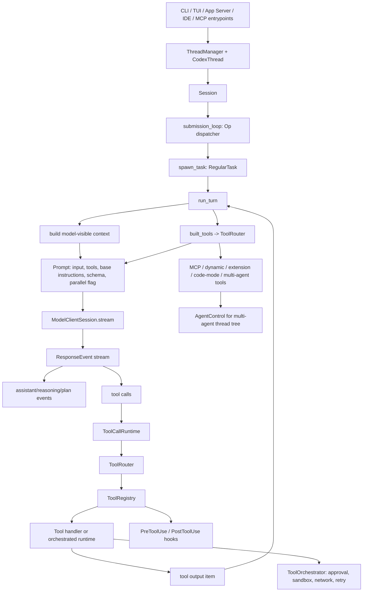

# openai/codex

## Repository Identity

| Field | Value |
| --- | --- |
| Repository | `https://github.com/openai/codex` |
| Analyzed ref | `main` |
| Analyzed commit | `f959e7fc9832dfa0ebfb6542ab1bbf829638ac24` |
| Commit date observed | `2026-06-24T08:57:34Z` |
| Commit subject observed | `[codex] Emit implicit skill usage for support reads (#29731)` |
| Local analysis path | Temporary checkout during analysis only |
| Indexing | CodeGraph initialized: 3,185 files, 101,806 nodes, 157,493 edges |
| Main implementation | `codex-rs` Cargo workspace; README describes Codex CLI as a local coding agent |
| Distribution | `curl` installer, npm `@openai/codex`, Homebrew cask, release binaries |
| License | Apache-2.0 |

This note is a repository deep-read of the `openai/codex` implementation as of the analyzed commit. It is source-specific evidence for [[coding-agent-systems|Coding agent systems]], not a complete survey of all coding agents.

## Reading Coverage

| Area | Files / symbols read | Why it matters |
| --- | --- | --- |
| Workspace shape | `README.md`, `codex-rs/Cargo.toml`, `codex-rs/*` crate tree | Identifies Rust workspace boundaries: `core`, `tui`, `app-server`, `protocol`, `exec-server`, `execpolicy`, `sandboxing`, `tools`, `codex-mcp`, `core-skills`, extensions. |
| Session and lifecycle | `codex-rs/core/src/session/session.rs:26`, `:447`, `:486`, `:573`, `:682`; `session/mod.rs:590`, `:1247`, `:3120` | Shows thread/session state, base instructions, startup prewarm, startup parallelism, model-visible context assembly. |
| Agent loop | `session/handlers.rs:186`, `:705`; `session/turn.rs:128`, `:217`, `:273`, `:1871` | Shows submission loop, user turn spawning, sampling loop, streaming response handling, tool feedback loop. |
| Prompt and context engineering | `session/turn.rs:498`, `:1029`, `:1162`; `agents_md.rs:1`, `:120`, `:153`; root `AGENTS.md` | Shows base instructions, dynamic developer/contextual-user fragments, skills/plugins/apps injection, AGENTS.md discovery, token-bounded project docs. |
| Tool routing | `tools/router.rs:28`, `:100`, `:113`; `tools/spec_plan.rs:160`, `:236`, `:620`, `:795`, `:889`, `:920`, `:968` | Shows conversion from model response items to tool calls, direct/deferred/hidden exposure, namespace merge, MCP/dynamic/extension/multi-agent registration. |
| Parallel tool calls | `tools/parallel.rs:31`, `:89`, `:115`; `tools/registry.rs:267`, `:382`; `tools/tool_executor.rs:64`; `tools/handlers/mcp.rs:76`; `tools/handlers/unified_exec/exec_command.rs:96` | Shows per-tool parallel capability, runtime RwLock coordination, default non-parallel executor contract, read-only MCP and exec exceptions. |
| Multi-agent | `agent/control.rs:89`, `:141`, `:184`, `:286`; `agent/control/spawn.rs:197`; `tools/handlers/multi_agents_v2/spawn.rs:39`; `send_message.rs:24`; `followup_task.rs:24`; `wait.rs:37`; `session/multi_agents.rs:38`; `context/multi_agent_mode_instructions.rs:6` | Shows thread-tree control plane, mailbox communication, spawn/send/followup/wait/list/interrupt surface, and prompt mode gating. |
| Safety and permission harness | `tools/orchestrator.rs:1`, `:134`, `:230`, `:297`, `:510`; `execpolicy/src/policy.rs:28`; `execpolicy/src/rule.rs:37`, `:117`; `sandboxing/src/lib.rs:1`; `request_permissions.rs:42` | Shows approval, guardian, permission hooks, sandbox selection, network policy, retry/escalation, execpolicy rules, and request-permissions tool. |
| Skills | `core-skills/src/service.rs:65`, `:126`; `core-skills/src/injection.rs:63`, `:138`; `core/src/context/available_skills_instructions.rs:8`; `core/templates/*`; `ext/skills/*` | Shows host skill discovery/cache, explicit skill mention matching, full `SKILL.md` injection, available-skills developer fragment, extension surface. |
| Harness and tests | `core/tests/common/test_codex.rs`, `core/tests/common/responses.rs`, `core/tests/suite/tool_parallelism.rs`, `core/tests/suite/multi_agent_mode.rs`, many `core/tests/suite/*` | Shows mock Responses servers, captured request bodies, integration tests for tool parallelism, multi-agent prompt mode, approvals, hooks, sandbox, skills, compaction. |
| Performance and context budget | `session/session.rs:573`, `:682`; `session/turn.rs:150`, `:210`, `:334`, `:902`; `tools/context.rs:113`; `tool_search.rs:25`; `core-skills/src/service.rs:65` | Shows startup parallel futures, turn-scoped model client reuse, auto-compaction, output truncation, tool-search cache, skill cache. |

## Architectural Map

## Main Modules And Boundaries

| Boundary | Concrete evidence | Interpretation |
| --- | --- | --- |
| `codex-core` as runtime core | `Session` holds `thread_id`, `state`, `conversation`, `active_turn`, `input_queue`, `guardian_review_session`, `services` (`session/session.rs:26-47`). | Core owns thread state, turn state, event delivery, prompt assembly, tools, safety, extensions. |
| Protocol and app surfaces | Workspace includes `app-server`, `app-server-protocol`, `protocol`, `app-server-test-client`; generated TS schemas include `CollabAgentTool` and `MultiAgentMode`. | UI/desktop/IDE/app-server see a stable event/request protocol, not direct Rust internals. |
| Execution and sandboxing | Workspace includes `exec-server`, `execpolicy`, `sandboxing`, `shell-command`, `network-proxy`; orchestrator imports `SandboxManager`, exec approval requirement, network approval. | Tool execution is separated from policy/sandbox mechanisms, then recomposed in `ToolOrchestrator`. |
| Tool ecosystem | `spec_plan.rs` adds shell, MCP resources, core utilities, collaboration, MCP runtime, extension, dynamic, hosted tools (`spec_plan.rs:620-631`). | The model-visible tool list is planned per step, not a static global list. |
| Skills and plugins | Session init warms plugin skill roots and `SkillsService` snapshots (`session/session.rs:447-466`); per turn builds skill/plugin injection (`turn.rs:498-663`). | Skills are model-context artifacts with explicit invocation and cached discovery, not generic plugins. |
| Tests as harness | `core/tests/common/responses.rs` captures Responses request bodies and decodes zstd (`responses.rs:130-163`); `tool_parallelism.rs` drives mock SSE streams. | Agent behavior is tested by simulating model streams and asserting protocol/context/tool behavior end-to-end. |

## Agent Loop Engineering

The Codex loop is an evented submit/turn/sample/tool-feedback loop.

1. `submission_loop` continuously receives `Submission` and dispatches `Op` variants such as `UserInput`, `InterAgentCommunication`, approval responses, dynamic tool responses, MCP refresh, compact, review, and shutdown (`session/handlers.rs:705-858`).
2. `user_input_or_turn_inner` builds a `TurnContext`, tries to steer an active turn, otherwise merges additional context and spawns a regular task (`session/handlers.rs:186-268`).
3. `run_turn` states the loop contract directly: the model replies with function calls or an assistant message; tool calls are executed and returned to the model in the next sampling request, while assistant-only responses complete the turn (`session/turn.rs:128-142`).
4. Each turn records model-visible context updates, builds skills/plugins, runs session start and input hooks, records injection items, creates a `TurnDiffTracker`, then loops over sampling requests (`session/turn.rs:150-217`).
5. In the loop, pending input can be drained, time/budget reminders can be recorded, a `StepContext` is captured so tools and context share the same request view, and `run_sampling_request` is invoked (`session/turn.rs:217-284`).
6. After sampling, Codex checks whether the model needs follow-up or there is pending input, and may run auto-compaction before continuing (`session/turn.rs:293-357`).
7. `try_run_sampling_request` streams Responses events, records TTFT, dispatches completed tool items, and pushes tool futures into `FuturesOrdered` (`session/turn.rs:1871-2053`).

Reusable agent-loop pattern:

- Keep submission handling separate from turn execution.
- Capture per-step context once, then build tools and prompt from the same view.
- Treat tool calls as asynchronous work but return ordered model-visible outputs.
- Keep pending user input and inter-agent mailbox input distinct from the current model stream.
- Install compaction/new-context behavior inside the loop, not only as a manual command.

## Tool Calling And Parallel Calling

### Tool planning

`built_tools` loads all MCP tools, plugins, app/connectors, discoverable tools, MCP direct/deferred exposure, extension executors, and dynamic tools, then builds a `ToolRouter` (`session/turn.rs:1162-1294`). `ToolRouter` stores a registry plus model-visible specs (`tools/router.rs:35-38`).

`spec_plan.rs` centralizes tool sources:

- shell/unified exec tools (`spec_plan.rs:648-690`)
- MCP resource tools (`spec_plan.rs:706-712`)
- core utility tools such as plan, request_user_input, request_permissions, token budget, apply_patch, view_image (`spec_plan.rs:715-792`)
- collaboration/multi-agent tools (`spec_plan.rs:795-879`)
- MCP runtime tools, direct or deferred (`spec_plan.rs:889-912`)
- dynamic tools (`spec_plan.rs:920-950`)
- extension tools (`spec_plan.rs:957-1048`)
- tool_search for deferred tools (`spec_plan.rs:968-989`)

Tool exposure is not binary. `ToolExposure` supports `Direct`, `Deferred`, `DirectModelOnly`, and `Hidden` (`codex-rs/tools/src/tool_executor.rs:13-36`). Deferred tools are omitted from initial visible specs, but become searchable when `tool_search` is enabled.

### Tool call parsing and dispatch

`ToolRouter::build_tool_call` maps Responses items into runtime calls:

- `ResponseItem::FunctionCall` becomes a `ToolCall` with namespace/name, call id, and function arguments.
- client `ToolSearchCall` becomes `tool_search`.
- `CustomToolCall` becomes a custom payload.
- server-executed search calls return `None` (`tools/router.rs:112-160`).

`ToolRegistry::dispatch_any_with_terminal_outcome` then:

1. increments active turn tool-call accounting (`tools/registry.rs:433-438`);
2. checks the tool exists and matches payload kind (`tools/registry.rs:441-490`);
3. emits lifecycle start (`tools/registry.rs:493`);
4. runs `PreToolUse` hooks that may block or rewrite input (`tools/registry.rs:495-538`);
5. executes the handler with telemetry (`tools/registry.rs:545-569`);
6. runs `PostToolUse` hooks, which can add context, block a result, or replace model-visible feedback (`tools/registry.rs:583-655`);
7. records completed/failed dispatch trace (`tools/registry.rs:657-669`).

### Parallelism mechanism

Parallel tool calls are two-layered:

1. Prompt-layer capability: `build_prompt` passes `parallel_tool_calls: turn_context.model_info.supports_parallel_tool_calls` to the model request (`session/turn.rs:1028-1044`).
2. Runtime-layer guard: each handler advertises whether it supports parallel execution. The default `ToolExecutor::supports_parallel_tool_calls` is `false` (`codex-rs/tools/src/tool_executor.rs:64-66`).

`ToolCallRuntime` holds a per-step `RwLock<()>` (`tools/parallel.rs:31-38`). For every tool call, it asks the router whether the specific tool supports parallel calls (`tools/parallel.rs:89`):

- parallel-capable tools take a shared read lock;
- non-parallel tools take the exclusive write lock;
- all tool dispatches are spawned as Tokio tasks (`tools/parallel.rs:115-135`).

This means multiple parallel-safe tools can overlap, but one non-parallel tool serializes with all others. Hidden tools cannot gain parallel support through exposure override because `ExposureOverride::supports_parallel_tool_calls` requires non-hidden exposure (`tools/registry.rs:267-269`).

Examples:

- `exec_command` opts into parallel calls (`tools/handlers/unified_exec/exec_command.rs:96-98`).
- MCP tools support parallel calls when server metadata opts in or the MCP annotation says read-only (`tools/handlers/mcp.rs:76-87`).
- MCP resource reads and tool_search are parallel-safe (`read_mcp_resource.rs:39-40`; `tool_search.rs:106-108`).

Harness evidence:

- `tool_parallelism.rs` verifies read-file-like test tools run in parallel, shell tools run in parallel, mixed tools run in parallel, function-call outputs are grouped after calls and ordered by call id, and shell tools start before `response.completed` when streaming completion is delayed (`core/tests/suite/tool_parallelism.rs:91-183`, `:224-297`, `:302-436`).

## Multi-Agent Orchestration

Multi-agent is not the same mechanism as parallel tool calls. It is a control plane over a thread tree.

`AgentControl` is described as the control-plane handle for multi-agent operations. It is created once per root thread/session tree and shared by sub-agents, keeping the registry scoped to that root (`agent/control.rs:89-108`). It can:

- send input to existing agent threads (`agent/control.rs:141-181`);
- send encrypted inter-agent communication (`agent/control.rs:184-205`);
- interrupt agents (`agent/control.rs:207-216`);
- resolve relative agent references through `AgentPath` (`agent/control.rs:286-305`);
- subscribe to agent status (`agent/control.rs:307-315`).

`spawn_agent_internal` determines the effective multi-agent version, checks execution capacity, reserves V2 residency or spawn slots, inherits environments/exec policy/multi-agent mode, and creates a new live agent (`agent/control/spawn.rs:197-244`).

V2 collaboration tools include:

- `spawn_agent`: computes effective multi-agent mode, builds spawn config, creates a canonical task path, optionally converts text into encrypted `InterAgentCommunication`, emits `SubAgentActivityEvent`, and returns task metadata (`multi_agents_v2/spawn.rs:39-183`).
- `send_message`: queues a message only (`send_message.rs:24-39`).
- `followup_task`: sends a message and triggers a target turn (`followup_task.rs:24-39`).
- `wait_agent`: waits on `InputQueueActivity` mailbox/steer with configured min/default/max timeouts (`multi_agents_v2/wait.rs:37-111`).
- `list_agents` and `interrupt_agent`: expose registry/query/control operations.

The mailbox integration is explicit:

- `communication_from_tool_message` builds encrypted `InterAgentCommunication` with `trigger_turn: true` (`multi_agents_v2.rs:43-55`).
- `inter_agent_communication` enqueues mailbox communication and starts a pending-work turn only when `trigger_turn` is true (`session/handlers.rs:280-295`).
- `try_run_sampling_request` can preempt commentary/reasoning continuation when mailbox items are pending, making V2 inter-agent communication responsive (`session/turn.rs:2021-2064`).

Prompt gating is separate from tool availability:

- `MultiAgentMode` supports `none`, `explicitRequestOnly`, and `proactive`; generated schema says `none` leaves tools available without delegation instructions.
- `MultiAgentModeInstructions` injects developer text for explicit-only or proactive mode (`context/multi_agent_mode_instructions.rs:6-43`).
- `effective_multi_agent_mode` only applies V2 mode to root-like or thread-spawn sources, not internal sub-agent sources (`session/multi_agents.rs:38-57`).
- `spec_plan.rs` registers V2 tools when multi-agent V2 is enabled and V1 tools otherwise; V2 can be `Direct` or `DirectModelOnly` depending on config (`spec_plan.rs:795-848`).

Harness evidence:

- `multi_agent_mode.rs` verifies multi-agent mode stickiness, injection only on changes, omission under `None`, and resume behavior (`core/tests/suite/multi_agent_mode.rs:63-232`).

## Safety, Permissions, Sandbox, And Guardian

The safety path is orchestrated per tool attempt.

`ToolOrchestrator` is documented as the central place for approvals, sandbox selection, retry semantics, and the sequence approval -> select sandbox -> attempt -> retry with escalated sandbox strategy (`tools/orchestrator.rs:1-8`).

The main `run` method:

1. computes strict auto-review and guardian routing (`orchestrator.rs:145-150`);
2. derives the approval requirement from the tool or default policy/sandbox policy (`orchestrator.rs:154-158`);
3. handles skip, forbidden, and approval-needed cases (`orchestrator.rs:159-220`);
4. chooses first-attempt sandbox using filesystem policy, network policy, sandbox preference, Windows sandbox level, and managed network state (`orchestrator.rs:223-277`);
5. runs the attempt with network approval lifecycle (`orchestrator.rs:61-132`, `:279-287`);
6. on sandbox denial, checks whether network denial can become approval context, whether the tool can escalate, whether unsandboxed retry is allowed, whether fresh guardian review is needed, and then retries with sandbox or no sandbox (`orchestrator.rs:297-493`);
7. lets permission-request hooks answer prompts before falling back to guardian/user approval (`orchestrator.rs:510-575`);
8. converts denial/abort/timeout/network amendment into model-visible rejection or permission changes (`orchestrator.rs:577-604`).

`request_permissions` is a model-callable path to ask for additional environment permissions. It normalizes requested permissions, rejects empty requests, and waits for the user/host response (`request_permissions.rs:42-120`).

`execpolicy` provides a rule layer:

- `Policy` stores command prefix rules, network rules, and host executable resolution (`execpolicy/src/policy.rs:28-32`).
- Prefix rules match fixed first token plus rest tokens, with decisions and optional justifications (`execpolicy/src/rule.rs:37-76`, `:110-115`).
- Network rules normalize host/protocol and disallow wildcard/invalid host patterns (`execpolicy/src/rule.rs:117-211`).

Sandboxing is platform-specific behind `SandboxManager`, with Linux bwrap/landlock, macOS seatbelt, and Windows sandbox support exposed from `sandboxing/src/lib.rs:1-33`.

## Skills, Plugins, And Context Engineering

Skills are a prompt/context mechanism with explicit invocation semantics.

`SkillsService` owns host skill discovery, immutable snapshots, cache invalidation, extra roots, and bundled/system skill installation (`core-skills/src/service.rs:65-100`). It caches snapshots by effective skill-relevant config so role-local or session-local overrides do not bleed across sessions sharing a directory (`service.rs:114-148`).

`build_skill_injections`:

- accepts mentioned skills;
- reads the exact `SKILL.md` via the skill's filesystem;
- emits telemetry and analytics;
- pushes the full `SkillInjection` with name, path, and contents;
- returns warnings if loading fails (`core-skills/src/injection.rs:63-116`).

`collect_explicit_skill_mentions` resolves structured `UserInput::Skill` selections first by path, then scans text for `$skill-name` style tokens and only uses unambiguous plain-name matches (`injection.rs:138-205`).

Per turn, `build_skills_and_plugins`:

- skips skill/plugin mention interpretation for guardian reviewer sessions because the parent transcript is untrusted evidence (`turn.rs:498-509`);
- extracts user text input, plugin mentions, MCP/app inventory, available connectors, skill snapshot, extension turn inputs, and explicit skill mentions (`turn.rs:511-578`);
- prompts/install MCP dependencies for mentioned skills (`turn.rs:579-586`);
- builds skill injections and warnings (`turn.rs:588-606`);
- collects connector IDs referenced from injected skill prompts (`turn.rs:608-620`);
- merges skill, plugin, and extension injection items (`turn.rs:650-663`).

Thread start context also includes available skills as a developer fragment when enabled (`session/mod.rs:3205-3226`). Plugins and apps are similarly rendered as developer/contextual user fragments (`session/mod.rs:3191-3260`).

AGENTS.md/project docs are bounded and ordered:

- scan from project root to cwd, not past project root (`agents_md.rs:1-16`);
- enforce `project_doc_max_bytes`, truncating when needed (`agents_md.rs:88-143`);
- prefer `AGENTS.override.md`, then `AGENTS.md`, then configured fallbacks (`agents_md.rs:244-258`).

Root `AGENTS.md` for this repo is itself useful prompt-engineering evidence: it says model-visible context must be built incrementally, not rewritten; injected fragments must be bounded and hard-capped; large prompt items need review; and all injected fragments should be structured `core/context` types.

## Prompt Engineering Surfaces

Codex separates prompt inputs into several layers:

- base model instructions from config, prior rollout history, or model default (`session/mod.rs:590-605`);
- developer instructions from config, collaboration mode, permissions, apps, skills, plugins, extensions, personality, realtime, token budget, and multi-agent mode (`session/mod.rs:3120-3385`);
- contextual user sections from plugin recommendations, extension context, user instructions, and world-state fragments (`session/mod.rs:3250-3390`);
- model-visible tools from `ToolRouter::model_visible_specs` (`turn.rs:1029-1038`);
- output schema and strictness, with guardian reviewer sessions exempt from strict schema (`turn.rs:1040-1043`);
- plan-mode streaming parser that treats proposed plan XML-ish content differently from normal assistant text (`turn.rs:1302` onward; tested under plan/collaboration suites).

The central prompt object is built in `build_prompt`, not scattered across tool handlers (`turn.rs:1028-1045`).

## Performance And Context Budgeting

Performance is distributed across startup, turn loop, tool execution, discovery, and context management.

| Mechanism | Evidence | Effect |
| --- | --- | --- |
| Startup async parallelism | Session init starts thread persistence, state DB, auth/MCP setup and joins them (`session/session.rs:573-687`). | Reduces thread startup latency by overlapping independent work. |
| Prewarm skills/plugins | `warm_plugins_and_skills_for_session_init` loads plugin skill roots and skill snapshots (`session/session.rs:447-466`). | Avoids cold skill/plugin loading on first real turn. |
| Turn-scoped model client | `ModelClientSession` is reused across retries within a turn because it caches WebSocket and sticky routing state (`turn.rs:210-216`). | Avoids recreating model transport for retry/follow-up loops. |
| Retry loop | `run_sampling_request` uses provider `stream_max_retries` and `handle_retryable_response_stream_error` (`turn.rs:1084-1150`). | Keeps streaming failures recoverable without losing original prompt input. |
| Tool concurrency | `ToolCallRuntime` spawns per-tool tasks and gates them by read/write lock (`tools/parallel.rs:115-135`). | Allows overlap for declared parallel-safe tools while serializing unsafe ones. |
| Auto compaction | pre-sampling and mid-turn compaction can use token-budget, remote v2, remote, or local compact paths (`turn.rs:902-975`, `:334-357`). | Prevents context-window overflow during long tool/model loops. |
| Output truncation | MCP tool output is headered and truncated before context injection (`tools/context.rs:113-143`). | Bounds model-visible tool output. |
| Tool search cache | `ToolSearchHandlerCache` reuses BM25 handlers for identical search infos (`tool_search.rs:31-58`). | Avoids rebuilding search indexes for deferred tools. |
| Skills cache | `SkillsService` caches snapshots by cwd/config (`core-skills/src/service.rs:65-148`). | Avoids repeated filesystem scans and avoids config bleed. |

## Harness Engineering

Codex's tests are agent-behavior harnesses rather than only unit tests.

Key harness pieces:

- `core/tests/common/test_codex.rs` builds temp local or remote environments, mock model servers, and configured `CodexThread` instances (`test_codex.rs:1-180`).
- `core/tests/common/responses.rs` captures outgoing Responses request bodies, decodes compressed bodies, exposes instruction text, message input text, tools, function-call inputs and outputs (`responses.rs:38-180`).
- `core/tests/common/streaming_sse.rs` and `responses.rs` allow synthetic SSE streams, delayed chunks, model event sequences, and WebSocket tests.
- `core/tests/suite/*` covers approvals, auto review, guardian review, hooks, MCP, skills, request permissions, tool exposure, tool parallelism, multi-agent mode, truncation, compaction, token budget, model switching, shell/unified exec, sandbox variants, and remote environments.

The root `AGENTS.md` reinforces this harness approach: agent logic changes should prefer integration tests under `core/suite` using `test_codex`, and breaking changes must be checked across app-server APIs, raw response events, CLI params, config loading, and rollout resume behavior.

## Important Distinctions

| Concept pair | Codex implementation distinction |
| --- | --- |
| Parallel tool calls vs multi-agent | Parallel tool calls are same-turn execution tasks guarded by per-tool `supports_parallel_tool_calls` and an RwLock. Multi-agent is a thread-tree control plane via `AgentControl`, `SessionSource::SubAgent`, mailbox communication, and independent turns. |
| Tool availability vs prompt encouragement | Multi-agent V2 tools can remain registered while `MultiAgentMode::None` omits delegation instructions. Tool surface and prompt policy are separate. |
| Direct tools vs deferred tools | Direct tools are in the initial model-visible list. Deferred tools are registered and searchable via `tool_search` when supported. |
| Tool execution vs safety decision | Tool handlers do work; `ToolOrchestrator` coordinates approval, guardian/user review, sandbox selection, network approval and retry. |
| AGENTS.md vs skills | AGENTS.md is project/user instruction discovery. Skills are explicit, named `SKILL.md` bodies injected when selected or mentioned. |
| Hosted tools vs extension tools | Hosted search/image tools may come from provider capabilities. Extension tools enter through `ExtensionToolAdapter` and the same executor contract. |
| Model prompt parallel flag vs runtime parallelism | The prompt advertises whether the model supports parallel tool calls; runtime still serializes any handler that does not opt in. |

## Source-Specific Lessons For Agent Systems

1. Agent loop engineering benefits from a submission loop, a turn loop, and a sampling/tool-feedback loop as separate units.
2. Tool parallelism should be capability-based at the handler/runtime level, not merely model-controlled.
3. Multi-agent orchestration needs a control plane with identity, thread tree, capacity, status, path resolution, and mailbox semantics.
4. Safety belongs near execution orchestration, where approval, sandbox, network denial, retry and telemetry can be reasoned about together.
5. Prompt engineering becomes maintainable when all injected fragments are typed, bounded, provenance-aware, and inserted at predictable context phases.
6. Skills should be explicit artifacts with path-qualified identity and dependency handling, not ad hoc prompt snippets.
7. Harness engineering for agents needs mock model streams and captured model requests, because many regressions happen in event order, context shape, or tool output replay.
8. Performance work in agents is often context-budget and orchestration work: prewarming, caching, compacting, streaming retries, and concurrent safe execution.

## Absorption Targets

This source was absorbed into:

- [[ai-agents|AI agents]]
- [[coding-agent-systems|Coding agent systems]]
- [[agent-loop-engineering|Agent loop engineering]]
- [[tool-use-and-parallelism|Tool use and parallelism]]
- [[multi-agent-orchestration|Multi-agent orchestration]]
- [[safety-and-permission-harness|Safety and permission harness]]
- [[skills-and-context-engineering|Skills and context engineering]]
- [[eval-and-harness-engineering|Eval and harness engineering]]
- [[performance-and-context-budgeting|Performance and context budgeting]]
- [[tool-parallelism-to-multi-agent-orchestration|Tool parallelism -> multi-agent orchestration]]

## Refresh Rules

- Last checked: `2026-06-24`
- Valid until: `2026-07-24`
- Refresh triggers: new Codex multi-agent version, changes to `ToolCallRuntime`, `ToolOrchestrator`, skills injection, app-server protocol, Responses event handling, tool exposure model, or major `codex-rs/core` refactor.
