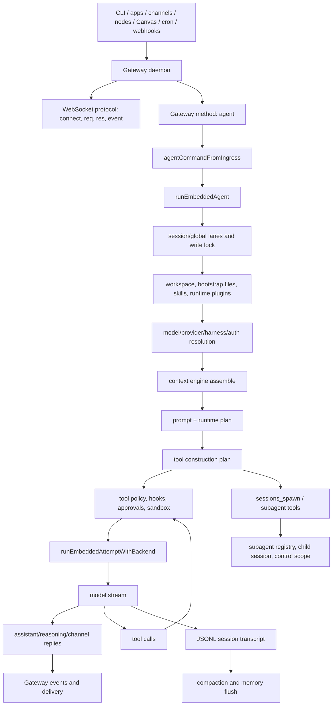

# openclaw/openclaw

## Repository Identity

| Field | Value |
| --- | --- |
| Repository | `https://github.com/openclaw/openclaw` |
| Analyzed ref | `main` |
| Analyzed commit | `751a6c23f098e16a82f4afe7d4d674df1412a968` |
| Default branch source | `git ls-remote --symref` |
| License | MIT |
| Version observed | `package.json` name `openclaw`, version `2026.6.10`, package manager `pnpm@11.2.2` |
| Language mix observed | TypeScript 68.8%, Swift 20.6%, Kotlin 5.7%, JavaScript 1.9%, Python 1.0%, CSS 0.9%, Shell 0.9%, Other 0.2% |
| Repository tree size | GitHub tree API: 21,790 items, 20,611 files, 1,179 directories, not truncated |
| Largest top-level code/document areas | `src`, `extensions`, `apps`, `scripts`, `docs`, `test`, `ui`, `packages`, `qa`, `.agents`, `skills` |
| Local raw snapshot | Temporary raw snapshot during analysis only; selected files, not a full checkout |
| Scoped CodeGraph | Initialized on selected raw snapshot: 110 files, 6,559 nodes, 14,983 edges |

This is a scoped repository deep-read of OpenClaw as a personal agent system. It is evidence for [[coding-agent-systems|Coding agent systems]] and a comparison point against [[openai-codex-main-f959e7f|openai/codex]].

## Coverage And Limits

| Area | Evidence used | Coverage |
| --- | --- | --- |
| Product and workflow | `README.md`, `VISION.md`, `AGENTS.md`, CLI docs | Strong enough to describe onboarding, Gateway daemon, workspace, channels, skills, tools, and security defaults. |
| Gateway protocol | `docs/concepts/architecture.md`, `docs/gateway/protocol.md`, `src/gateway/server-methods/agent.ts` | Strong for Gateway as control plane, WS frames, agent RPC, idempotency, pairing/auth. |
| Agent loop | `docs/concepts/agent.md`, `docs/concepts/agent-loop.md`, `src/agents/embedded-agent-runner/run.ts`, attempt files | Strong for high-level and code-level loop shape. |
| Tool construction and policy | `src/agents/agent-tools.ts`, `attempt-tool-construction-plan.ts`, `agent-tools.policy.ts`, `agent-tools.before-tool-call.ts`, sandbox files | Strong for tool-family construction, policy layering, sandbox bridge, before-tool hooks. |
| Sessions/context/memory | `docs/concepts/session.md`, `context-engine.md`, `memory.md`, context-engine source, session-manager source | Strong for session persistence, context engine lifecycle, memory-file design, compaction. |
| Multi-agent | `docs/concepts/multi-agent.md`, `delegate-architecture.md`, `subagent-spawn.ts`, `subagent-control.ts`, `subagent-registry.ts`, `sessions-spawn-tool.ts` | Strong for native subagent semantics, control scope, registry, child session spawning. |
| Plugins/hooks/providers | `docs/plugins/*`, `docs/concepts/model-providers.md`, runtime/plugin source | Good for architecture and extension boundaries; not every plugin implementation was audited. |
| QA | `docs/concepts/qa-e2e-automation.md`, package scripts scan | Good for QA architecture; no test suite was run locally. |
| Mobile/desktop UI/channel adapters | Tree scan plus selected docs | Insufficient for detailed adapter-by-adapter or app UI audit. |

## Top-Level Thesis

OpenClaw is not just a coding CLI. It is a local-first personal agent platform:

1. A long-lived Gateway is the control plane.
2. Channels, companion apps, CLI, nodes, Canvas, and automation connect to the Gateway.
3. The Gateway routes inbound messages into sessions and calls an embedded agent runtime.
4. The embedded runtime assembles workspace/bootstrap/skills/context, resolves model/provider/harness/auth, builds tools and policy, calls a model backend, executes tools, streams events, persists transcripts, and handles compaction.
5. Plugins, hooks, context engines, model providers, channels, memory, speech, web/search, and subagents are extension points around the same runtime.

This differs from Codex's narrower center of gravity. Codex is primarily a local coding-agent runtime with CLI/TUI/app-server surfaces. OpenClaw generalizes the agent into a daemonized personal assistant across channels, devices, sessions, memory, plugins, and delegated agents.

## Architectural Map

## End-To-End Workflow

### 1. Onboarding And Daemon

OpenClaw's README describes a setup flow centered on `openclaw onboard`, with gateway, workspace, channels, and skills setup. The Gateway daemon remains running after installation. The workspace defaults to `~/.openclaw/workspace`, and skills live under workspace and shared skill roots.

Practical implication: OpenClaw treats the agent as an always-available local service, not only as an interactive coding process started per task.

### 2. Gateway As Control Plane

The Gateway owns the connected surfaces. Architecture docs describe a long-lived Gateway with clients/nodes connected over a typed WebSocket API. The protocol uses `connect`, request/response frames, events, role/scope fields, idempotency keys for side-effecting methods, size limits, and diagnostics that avoid logging bodies or secrets. Pairing/authentication and device signatures are part of the surface.

The important implementation pattern is that every channel can become an ingress, but the Gateway normalizes it into typed methods and events. That gives OpenClaw one control plane for DMs, rooms, CLI invocations, companion apps, Canvas, cron, and plugin surfaces.

### 3. Inbound Message To Session

Session docs route messages by source: DMs, groups, rooms, cron, and webhooks can map into session keys. DM isolation is explicit, including `dmScope`; lifecycle policy can reset daily, after idle time, or manually. Gateway-owned session state and transcripts are stored under OpenClaw's runtime area, while the agent's working directory remains the configured workspace.

Practical implication: session identity is a channel/runtime object, not merely a chat transcript in the model prompt.

### 4. `agent` RPC Accepts And Deduplicates

`src/gateway/server-methods/agent.ts` validates a large method surface: message, agent id, provider/model, session id/key, thinking, delivery target, attachments, channel/reply channel/account/thread/group, lane, extra system prompt, model run, prompt mode, bootstrap context, ACP, internal handoff, exec approval followup, internal events, prompt persistence suppression, source reply mode, message tool disabling, timeout, cleanup, workspace override, voice wake trigger, and idempotency key.

The handler also authorizes model overrides and internal session effects, turns idempotency key into a run id, creates lifecycle metadata, validates exec approval followups, records input provenance, and returns cached accepted/final results when dedupe keys match.

Practical implication: OpenClaw's "agent call" is a Gateway transaction, not only a function that sends a prompt to a model.

### 5. Embedded Runtime Resolves The Run

`runEmbeddedAgent` resolves or backfills session keys, session targets, and session files; enters per-session/global lanes; applies queue priority and lane timeouts; claims run context; resolves workspace; loads runtime plugins; resolves explicit/default/alias models; selects provider/harness/auth; loads skills; chooses context engine; builds a runtime plan; and calls `runEmbeddedAttemptWithBackend`.

Docs describe the high-level loop as intake -> context assembly -> model inference -> tool execution -> streaming replies -> persistence, serialized per session. Source code shows that this serialization is concrete: session/global lanes and write locks prevent incoherent transcript mutation.

### 6. Context Assembly, Skills, Bootstrap

OpenClaw injects bootstrap files such as `AGENTS.md`, `SOUL.md`, `TOOLS.md`, `BOOTSTRAP.md`, `IDENTITY.md`, and `USER.md` on the first turn, with truncation and workspace attestation. Skills are loaded from workspace, `.agents/skills`, `~/.agents/skills`, `~/.openclaw/skills`, bundled roots, and extra dirs. Skill refresh uses watchers, caches, TTL, limits for candidates, loaded skills, prompt chars, file bytes, and scan depth.

Context engine docs define a pluggable lifecycle: ingest, assemble, compact, after-turn, subagent preparation, and maintenance. The TypeScript interface returns assembled messages, estimated tokens, prompt authority, system prompt additions, and optional context projection.

Practical implication: OpenClaw is moving context from ad hoc prompt concatenation toward a replaceable context engine interface.

### 7. Model Providers And Harnesses

Model provider docs split provider plugins from runtime/harness selection. Provider plugins own onboarding, catalog, auth, transport/config normalization, schema cleanup, failover, OAuth refresh, usage, and reasoning profiles. OpenAI/Codex-related docs note that `openai/<model>` can use a native Codex app-server harness by default, while explicit `agentRuntime.id: openclaw` uses the OpenClaw runtime.

Practical implication: "model" and "agent runtime" are separate axes. This is a stronger abstraction than hard-coding one provider transport inside the loop.

### 8. Tool Construction, Policy, Hooks, Sandbox

OpenClaw tool construction is family-based. `OpenClawCodingToolConstructionPlan` distinguishes base tools, shell tools, channel tools, OpenClaw tools, and plugin tools. The plan includes edit/read/write, apply_patch/exec/process, and OpenClaw tools such as agents_list, canvas, cron, gateway, goals, image, message, sessions_history/list/send/spawn/yield, skill_workshop, subagents, TTS, web_fetch/search, and update_plan.

The construction plan applies allowlists and plugin group expansion, then decides which families to construct based on disabled tools, raw allowlists, and forced message delivery. Effective tool policy combines config, session, agent, provider, model, group, and subagent capability layers. Subagents have always-denied and leaf-denied tools. The `before_tool_call` runtime runs plugin hooks, trusted policies, approvals, diagnostics, loop detection, skill telemetry, and argument adjustments before execution.

Sandbox docs and source show a backend/registry/bridge model: resolve a sandbox context for a run, create workspace layouts, sync sandbox skills, mount or bridge filesystem paths, guard reads/writes/mkdir/remove/rename, and persist sandbox registry state.

Practical implication: tools are not simply "available or unavailable". They are constructed by family, filtered by policy, wrapped by hooks, optionally approved, and executed under sandbox state.

### 9. Persistence, Compaction, Memory

Sessions are JSONL transcript trees under `~/.openclaw/agents/<agentId>/sessions/<SessionId>.jsonl`. The session manager supports messages, thinking entries, model entries, compaction entries, custom entries ignored by LLM context, custom message entries that do participate in LLM context, append-only tree building, forked sessions, and active-path context reconstruction.

Compaction docs describe summarizing older messages, automatic compaction near limits or after provider overflow, fallback chains, successor transcripts, and memory flush before compaction. Source code includes pre-prompt token-pressure estimation with safety margin and decision logic for compact/truncate. Memory docs model memory as Markdown files rather than hidden state: `MEMORY.md`, daily notes, `DREAMS.md`, and active memory tools such as `memory_search` and `memory_get`.

Practical implication: OpenClaw combines transcript persistence, summarization, and explicit file-backed memory. It is closer to a personal knowledge substrate than a single-session coding loop.

### 10. Subagents And Delegation

Multi-agent docs define agents as isolated personas with workspace, `agentDir`, sessions, and deterministic routing. Delegate architecture explicitly distinguishes acting on behalf of an organization from impersonating a human, and enforces hard blocks, tool restrictions, and sandbox isolation.

The native subagent path creates child sessions under keys such as `agent:<target>:subagent:<uuid>`, enforces max spawn depth and max children, computes child capabilities and inherited tools, handles sandbox inheritance, prepares context through the context engine, builds a subagent system prompt, materializes attachments, calls Gateway `agent` for the child with subagent lane and disabled message tool, registers the run, emits hooks, and supports list/kill/steer/send-message with controller ownership enforcement.

Practical implication: OpenClaw subagents are Gateway/session/runtime entities, not just parallel tool futures. They have registry lifecycle, control scope, child session keys, hooks, optional thread binding, and context-engine preparation.

## Agent Concepts Implemented In OpenClaw

| Concept | OpenClaw implementation | Source surface |
| --- | --- | --- |
| Agent identity | `agentId`, agent directory, workspace, persona/bootstrap files, sessions under agent-specific roots. | `docs/concepts/agent.md`, session docs, runtime source |
| Gateway/control plane | Long-lived daemon with typed WS protocol, role/scope handshake, idempotency and pairing. | `docs/concepts/architecture.md`, `docs/gateway/protocol.md` |
| Session | Channel/source routed session keys, JSONL transcript trees, lifecycle reset/maintenance, fork support. | `docs/concepts/session.md`, `sessions/session-manager.ts` |
| Agent loop | Gateway `agent` method -> ingress command -> `runEmbeddedAgent` lanes -> model attempt -> tools -> stream/persist/compact. | `agent-loop.md`, `agent.ts`, `run.ts` |
| Context | Bootstrap files, skills, system prompt contributions, context engine assemble/compact/after-turn. | `context-engine.md`, `system-prompt*`, `context-engine/*` |
| Memory | Markdown memory files, active memory plugin/search/get, daily distillation, flush before compaction. | `memory.md`, memory extension docs/source |
| Tools | Family construction plan, OpenClaw/channel/shell/plugin tools, allowlist/group expansion, policy layers. | `agent-tools.ts`, `attempt-tool-construction-plan.ts` |
| Approval/safety | DM pairing, role/scopes, effective tool policy, before-tool hooks, exec approval followup, sandbox backend/bridge. | README security, gateway docs, `agent-tools.before-tool-call.ts`, sandbox source |
| Model provider | Provider plugins, auth profiles, runtime/harness split, failover and config normalization. | `model-providers.md`, provider source |
| Plugins | Manifest/discovery, enablement, runtime loading, surface consumption, plugin runtime APIs. | `docs/plugins/architecture.md`, `sdk-runtime.md` |
| Hooks | Before model resolve/prompt build/tool call, compaction hooks, message hooks, lifecycle/subagent hooks. | `docs/plugins/hooks.md`, `hooks/*` |
| Subagents | Child sessions, registry, control scope, spawn depth/children limits, context engine spawn prep, kill/steer/send/list. | `subagent-spawn.ts`, `subagent-control.ts`, `subagent-registry.ts` |
| QA/evals | QA channel/lab/matrix, Docker gateway lane, Matrix/live-channel tests, package scripts for unit/e2e/gateway/perf/startup. | `qa-e2e-automation.md`, package script scan |

## OpenClaw vs Codex

| Dimension | OpenClaw | Codex evidence in vault | Comparison |
| --- | --- | --- | --- |
| Product center | Local-first personal assistant platform with Gateway daemon, channels, apps, Canvas, voice, memory, plugins, and coding tools. | Local coding agent CLI/TUI/app-server runtime. | OpenClaw broadens the host environment; Codex is deeper around coding-agent core/runtime integration. |
| Entry point | Typed Gateway RPC over WS plus CLI/channel/app ingress. | `submission_loop` over session `Op` values inside Codex thread/session runtime. | OpenClaw normalizes external surfaces at Gateway first; Codex normalizes inside the session loop. |
| Agent loop | `agent` RPC validates/dedupes, then `runEmbeddedAgent` handles lanes, runtime plugins, model/harness/auth/context/tool plan/attempts. | `submission_loop` -> `run_turn` -> `run_sampling_request` -> tool feedback. | Both split routing from sampling/tool feedback. OpenClaw adds daemon lanes and provider/harness/plugin resolution as first-class run plan. |
| Context model | Bootstrap files, skill roots/watchers, context engine interface, memory files, compaction hooks. | Base/developer fragments, AGENTS.md, skills, plugins/apps, token budget, auto-compaction. | Codex emphasizes bounded prompt construction for repo work; OpenClaw adds replaceable context engines and personal memory surfaces. |
| Tools | Tool family construction plan, group expansion, effective policy layers, before-tool hooks, sandbox bridge. | ToolRouter, ToolRegistry, ToolCallRuntime, ToolOrchestrator, supports_parallel RwLock. | Codex has clearer same-turn parallelism machinery; OpenClaw has broader family/policy/plugin/channel composition. |
| Multi-agent | Native subagents as child sessions with registry/control scope, Gateway child `agent` calls, context-engine preparation. | AgentControl thread tree, mailbox communication, multi-agent V2 tools. | Both expose delegation through tools but implement durable agent identity below the tool surface. |
| Safety | Gateway pairing/auth, DM defaults, role/scopes, tool policy layers, subagent denylists, sandbox registry/bridge, approvals. | Approval policy, guardian, permission hooks, execpolicy, sandbox, network approval and retry. | Codex concentrates safety near execution orchestration; OpenClaw distributes it through Gateway auth plus run/tool/sandbox policy. |
| Memory | Markdown `MEMORY.md`, daily notes, `DREAMS.md`, active memory search/get, flush before compaction. | Thread/session context, skills, AGENTS.md and compaction; no equivalent broad personal memory source in the absorbed Codex note. | OpenClaw makes personal memory a platform concept. |
| Model abstraction | Provider plugin and harness split; OpenAI/Codex harness can be selected separately from OpenClaw runtime. | Model client/session and provider details embedded in Codex core. | OpenClaw's architecture is more explicitly multi-provider/runtime pluggable. |
| QA | Channel-shaped QA stack, QA Lab, Docker gateway lane, Matrix/live-channel realism, extensive npm scripts. | Mock Responses streams, captured request assertions, integration suites. | Codex tests model request/event contracts tightly; OpenClaw adds multi-surface and channel realism. |
| Architectural philosophy | VISION favors plugin API, lean core, skills/ClawHub, MCP support, and explicitly avoids manager-of-managers/nested planner trees as default architecture. | Codex runtime keeps multi-agent as control plane reachable through tools. | Both avoid equating "more hierarchy" with better agency. OpenClaw states the anti-heavy-orchestration boundary more explicitly. |

## Notes For Knowledge Absorption

1. Keep [[tool-parallelism-to-multi-agent-orchestration|Tool parallelism -> multi-agent orchestration]] as a stable bridge. OpenClaw reinforces the same distinction: OpenClaw tool construction/policy/hook execution is not the same as subagent registry/session/control.
2. Add "Gateway/channel runtime" as a candidate topic under coding-agent systems. OpenClaw makes ingress/session delivery architecture central.
3. Add "context engine and memory" as a stronger OpenClaw branch. Codex currently covers prompt fragments/skills; OpenClaw adds file-backed memory and pluggable context-engine ownership.
4. Treat OpenClaw's QA evidence as harness architecture, not measured task-quality results.
5. Keep confidence `medium-high` because full repository clone failed. The selected raw snapshot is broad enough for workflow and agent concepts, but not enough for exhaustive extension/mobile/channel audits.

## Evidence Links

| Target node | Absorption role |
| --- | --- |
| [[ai-agents|AI agents]] | Expands domain from Codex-only coding runtime to local-first personal agent platform. |
| [[research-dynamics|AI agents Research Dynamics]] | Adds a second primary implementation source and shifts current-vault status from single-implementation to comparative implementation evidence. |
| [[coding-agent-systems|Coding agent systems]] | Adds Gateway/channel/plugin/memory-oriented runtime architecture. |
| [[agent-loop-engineering|Agent loop engineering]] | Adds Gateway `agent` RPC -> `runEmbeddedAgent` lane/attempt loop. |
| [[tool-use-and-parallelism|Tool use and parallelism]] | Adds tool family construction, allowlists, policy layers, plugin groups, before-tool hooks. |
| [[multi-agent-orchestration|Multi-agent orchestration]] | Adds subagent sessions, registry/control scope, spawn depth limits, context-engine subagent prep. |
| [[skills-and-context-engineering|Skills and context engineering]] | Adds bootstrap files, skill roots/watchers, context engine interface, memory files. |
| [[safety-and-permission-harness|Safety and permission harness]] | Adds Gateway pairing/auth, tool policy, sandbox bridge, subagent denylists, approvals. |
| [[eval-and-harness-engineering|Eval and harness engineering]] | Adds channel-shaped QA Lab and Docker/live-channel matrix. |
| [[performance-and-context-budgeting|Performance and context budgeting]] | Adds session/global lanes, preemptive compaction, successor transcripts, skill watcher cache, provider/harness failover. |

## Refresh Rules

- Re-fetch OpenClaw if default branch commit changes before making "current OpenClaw" claims.
- Run a full clone or archive intake before auditing specific mobile/channel/plugin implementations.
- Revisit comparison if Codex source notes are updated beyond `openai/codex@f959e7f` or if OpenClaw changes `src/agents/embedded-agent-runner`, `src/gateway/server-methods/agent.ts`, `src/agents/subagent-*`, `src/agents/agent-tools*`, `src/context-engine`, or `docs/plugins`.
