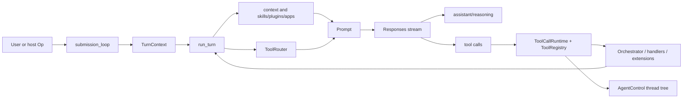

# Coding agent systems

## 概念

Coding agent systems are agent runtimes specialized for software work. They combine repository/project context, prompt fragments, tool execution, shell/sandbox policy, source-control aware workflows, code editing, long-running turn loops, and often IDE/app/server protocol surfaces.

Current evidence is implementation-centered and now comparative:

- [[openai-codex-main-f959e7f|openai/codex]]: local coding-agent runtime with CLI/TUI/app-server surfaces, tight tool runtime, safety orchestration and integration harness.
- [[openclaw-openclaw-main-751a6c2|openclaw/openclaw]]: local-first personal agent platform where the coding agent is embedded in a Gateway/channel/plugin/memory/subagent system.

## Codex-Backed Architecture Pattern

## Codex And OpenClaw As Two Implementation Families

| Layer | Codex pattern | OpenClaw pattern | Comparative reading |
| --- | --- | --- | --- |
| Host surface | CLI/TUI/app-server/session protocol around a local coding agent. | Long-lived Gateway with WS protocol, CLI, apps, channels, Canvas, cron, nodes and plugin surfaces. | Codex optimizes the coding runtime; OpenClaw optimizes always-on multi-surface personal agency. |
| Loop | `submission_loop` -> `run_turn` -> sampling/tool feedback/compaction. | Gateway `agent` RPC -> ingress command -> `runEmbeddedAgent` lanes -> model/harness/context/tool attempts. | Both separate external submission from model/tool feedback; OpenClaw adds Gateway transactions and per-run provider/harness resolution. |
| Tools | ToolRouter/ToolRegistry/ToolCallRuntime, explicit parallel capability and ToolOrchestrator safety. | Tool family construction plan, allowlists, plugin groups, effective policy layers, before-tool hooks, sandbox bridge. | Codex has a crisper same-turn parallelism mechanism; OpenClaw has broader policy/plugin/channel composition. |
| Context | Base/developer fragments, AGENTS.md, skills, plugins/apps, token-budget context. | Bootstrap files, skill roots/watchers, context engine lifecycle, Markdown memory, compaction hooks. | OpenClaw turns context into a replaceable engine and personal memory substrate. |
| Multi-agent | AgentControl thread tree, mailbox and V2 tools. | Native subagent child sessions, registry/control scope, Gateway child `agent` calls, context-engine spawn prep. | Both expose delegation as tools while implementing durable agent identity under the tool layer. |
| QA | Mock Responses streams and captured request assertions. | QA Lab, channel-shaped QA, Docker Gateway lane, Matrix/live-channel realism and package script matrix. | Codex checks model request/event contracts; OpenClaw checks platform/channel behavior. |

## Subtopics

| Topic | Role in coding agents | Evidence |
| --- | --- | --- |
| [[agent-loop-engineering|Agent loop engineering]] | Submission routing, turn execution, sampling, pending input, tool feedback, compaction. | `session/handlers.rs`, `session/turn.rs` |
| [[tool-use-and-parallelism|Tool use and parallelism]] | Runtime conversion of model calls into tool tasks, direct/deferred exposure, parallel-safety gates. | `tools/router.rs`, `tools/parallel.rs`, `tools/registry.rs` |
| [[multi-agent-orchestration|Multi-agent orchestration]] | Sub-agent thread tree, mailbox communication, status and capacity control. | `agent/control.rs`, `multi_agents_v2/*` |
| [[safety-and-permission-harness|Safety and permission harness]] | Approval, guardian, permission hooks, sandbox, network policy, retry. | `tools/orchestrator.rs`, `execpolicy`, `sandboxing` |
| [[skills-and-context-engineering|Skills and context engineering]] | AGENTS.md, skills, plugins, apps, extensions and bounded prompt fragments. | `core-skills`, `agents_md.rs`, `session/mod.rs` |
| [[eval-and-harness-engineering|Eval and harness engineering]] | Mock model streams, captured requests, integration suites. | `core/tests/common`, `core/tests/suite` |
| [[performance-and-context-budgeting|Performance and context budgeting]] | Startup join, prewarm, model client reuse, output truncation, auto-compaction. | `session/session.rs`, `turn.rs`, `tools/context.rs` |

## Design Claim

In Codex, the coding agent is not a single "LLM loop". It is a layered harness: protocol/session state, model-visible context assembly, per-step tool planning, tool dispatch lifecycle, safety/sandbox orchestration, optional multi-agent control plane, and integration tests that assert model request shape and event order.

OpenClaw supports the same design claim but adds a wider host architecture: Gateway control plane, channel ingress, typed WS protocol, plugins, memory, context-engine ownership, native subagent sessions, and companion apps. The "agent" becomes a platform service whose coding ability is one capability among channel messaging, automation, memory, voice, web/search and delegation.

## Evidence Boundary

`active_seed` because `openai/codex` and `openclaw/openclaw` are strong primary implementation sources. Needs external framework and benchmark sources before generalizing across all coding agents.

## Refresh Rules

- Refresh when new source notes cover other coding agents or Codex changes `core`, `tools`, `agent/control`, `core-skills`, app-server protocol, or exec/sandbox layers.
